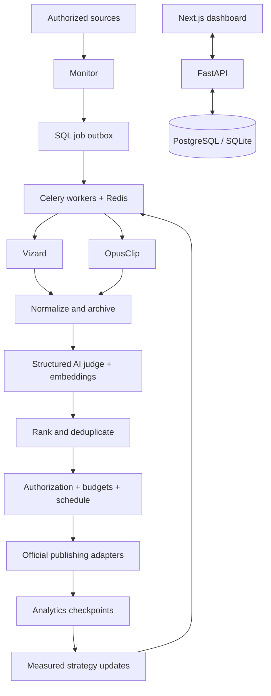

# ClipBot architecture

Next.js proxies same-origin requests to FastAPI. PostgreSQL (SQLite locally) is authoritative. Celery/Redis deliver persisted jobs; SQL leases and reconciliation protect against duplicate paid requests. Celery Beat drives discovery, publishing, analytics and strategy. n8n is event ingress only.

## Exact MVP
Submit one authorized video to both engines, retrieve and archive candidates, score structured transcripts, remove duplicates after both engines settle, review ranked clips, publish the top candidate to YouTube and attach analytics. Paid integrations require keys. Explicit demo adapters cannot publish externally.

## Implementation phases
Foundation → sources → Vizard → Opus → normalization → judging → deduplication → review → publishing → analytics → strategy → autopilot.

## Choices
Python 3.12 / FastAPI / Pydantic / SQLAlchemy / Alembic; Next.js / React / TypeScript / Tailwind; Celery / Redis; PostgreSQL; optional n8n. Celery has independent workers and operational tooling; SQL outbox survives broker outages. Ambiguous paid requests require reconciliation instead of blind retry. Local StorageProvider can be replaced with S3/R2.
